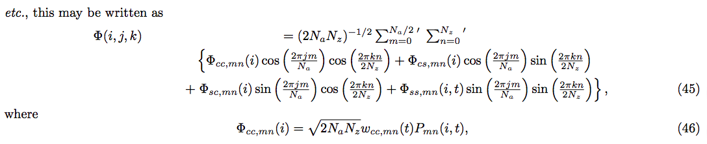

Potential Solution for P3D
----
The grid have NR arbitrarily spaced rings, Na  equally spaced azimuthal divisions and Nz planes spaced equally by the distance hz.

The solution of the potential is:  
1.use subroutine **p3manl** to do a double Fourier analysis of the masses <em>w(t, u, v)</em> assigned to each ring and plan <em>u, v</em>.  
2.followed by radial convolution of each separate sectoral harmonic <em>m</em> in **p3conv** (eq. 46).
3.completed by Fourier synthesis of the potential coefficients on each ring and plane <em>j, k</em> in subroutine **p3fsyn** (eq. 45).  

in code _p3fndf.f_
----
#### 1.determine the number of active sectoral harmonics

~~~
j = 0
do i = 1, ng
	if( .not. lg( i ) )j = j + 1
end do
ntypes = 3
if( potl )ntypes = 4
~~~
if potential is required, ntypes = 4  
if j > 0, then do next, else force free grid  

~~~
do itype = 1, ntypes
	do i = 1, mesh( jgrid )
		grdfld( i, itype ) = 0
	end do
end do
~~~

#### 2.determine radial range which contains all sources

~~~
jrs = nr( jgrid )
krs = 0
do i = 1, nzones
	jrs = min( jrs, jrad( i ) )
	krs = max( krs, krad( i ) )
	if( i .gt. 1 )krad( i ) = max( krad( i ), krs )
end do
~~~

### 3.copy mass array to work space

~~~
ispac = ( krs - jrs + 1 ) * na * ngz
ips = ngz * na * ( jrs - 1 )
call blkcpy( grdmss( ips + 1, 1 ), grdmss( 1, 0 ), ispac )
~~~
>call blkcpy(x, y, n) \# copy x(n) into y(n)

### 4.form double Fourier transform of mass array  
**p3manl** do Fourier analysis of each vector in turn  

>call p3manl(jrs, krs)  

~~~
j = 1
do m = 1, nrs * nm
	call sfftf1( mtrig, w( j ), trig, trig( mtrig + 1 ), trig( 2 * mtrig + 1 ) )
	j = j + mtrig
end do
~~~

### 5.assume forces are required over the whole grid unless told otherwise  

~~~
jrf = 1
if( ( jzone .gt. 0 ) .and. ( jrad( jzone ) .lt. nr( jgrid ) ) )jrf = jrad( jzone )
krf = nr( jgrid )
if( ( kzone .le. nzones ) .and. ( .not. wholeg ) )then
	krf = krad( kzone )
	do while ( krf .lt. jrf )
		kzone = kzone + 1
		if(kzone .gt. nzones )call crash( 'P3FNDF', 'kzone > nzones' )
		krf = krad( kzone )
	end do
end if
~~~

### 6.work over ntypes
no azimuthal forces when m = 0 only is selected  
>grdfld(mesh(jgrid), 2)=0 \# azimuthal force when itype = 2

else do radial convolution **p3conv**

>call p3conv( itype, jrs, krs, jrf, krf )

and re-synthesize

>call p3fsyn( itype, jrf, krf )

in code _findf.f_
----
use **p3fndf**
>call p3fndf(jzone, kzone)  
>call polcat \# convert to Cartesian components

set flag that gravitational fields are now current
>isfld = istep

p3test
----
<dl>
	<dt>p3chkf</dt>
		<dd>Routine to check the solution for the field on the 3-D polar code by direct convolution for a few point masses.</dd>
</dl>