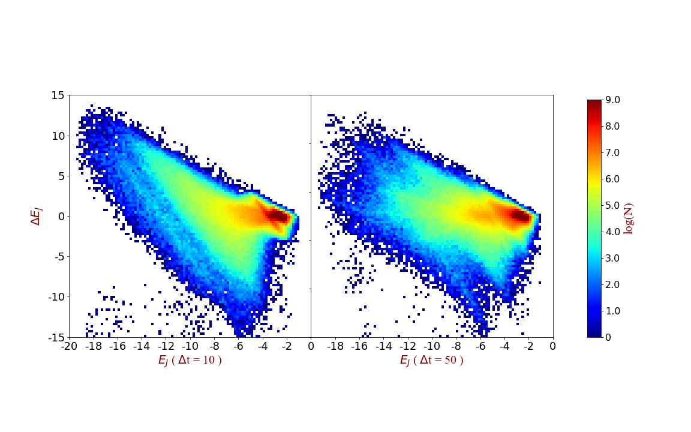
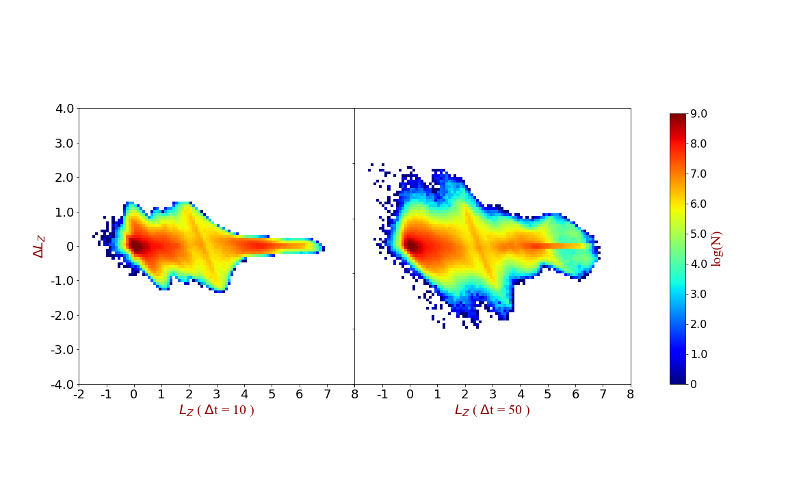

# Groove mode test

#### This report is on what I've got after adding the groove instability after some time of evolution (T = 150, in this case).  

NOTE:

It is the comparison of three models: 

1. **original bar-spiral model (no. 5018)**, with inner taper & groove from the beginning; 
2. model **without groove at all time (no. 6018)**; 
3. model with the **groove added at T = 150 (no. 6001)** .

All other parameters (i.e. except for the groove) are the same as the bar-spiral model.  

----

#### Here is what happens for the three models:

##### Amplitude for the bar region (0 ~ 3):

1. bar-spiral model (no. 5018):

   

2. model without the groove at all time (no. 6018):

   

3. model with the groove added at T = 150 (no. 6001):

   

##### Amplitude for the bar region (3 ~ 5):

1. bar-spiral model (no. 5018):

   

2. model without the groove at all time (no. 6018):

   

3. model with the groove added at T = 150 (no. 6001):

   

##### Amplitude for the bar region (5 ~ 7):

1. bar-spiral model (no. 5018):

   

2. model without the groove at all time (no. 6018):

   

3. model with the groove added at T = 150 (no. 6001):

   

#### Note:

1. only the amplitude after T=150 is plotted for the model (no. 6001).
2. when adding the groove at T = 150, we can see a decrease in the amplitude for the model (no. 6001);
3. but the amplitude for the model (no. 6001) seems to be more stable than the model without groove (no. 6018).

#### Comparison between model with groove at the beginning (no. 5018) and model with groove added at T = 150 (no. 6001):

1. The amplitude for the bar region (0 ~ 3) evolves into much weaker values for the second model (i.e. model 6001), but for the spiral region (5 ~ 7), the amplitudes are comparable (~ -2).
2. (???) This means adding a groove at later times make the bar weaker but creates similar spiral instabilities.

----

## The EJ & LZ for the Model with groove added at T = 150 (No. 6001)

#### The analyzed time scale is between 350 ~ 400, when the amplitude is generally stable for the model.

Pattern spped = 0.525

1. EJ
   
To make a comparison with original bar-spiral model (no. 5018):
   
2. LZ
   
To make a comparison with original bar-spiral model (no. 5018):
   

----

## Model with groove added at T = 200 (No. 6002)

#### test using different time of adding the groove instability in the model.

The stability & the amplitude of bar & spiral in the quasi-steady state for the two models is significantly different.  

T = 150

T = 200

----

## Conclusion

#### The analyzed time scale is between 350 ~ 400, when the amplitude is generally stable for the model.

1. the time of adding the groove into the model is important, the evolution of the amplitude still seems to be stochastic.
2. Model No. 6001 (with groove added at T = 150) gives a weaker bar & comparable spiral, compared to original bar-spiral model: stronger bar strengthen the change of **angular momentum & Jacobi energy**.
3. It is worth noting that in the change of EJ of Model No. 6001 (with groove added at T = 150), there are two ridges in the figure (I will do this later).