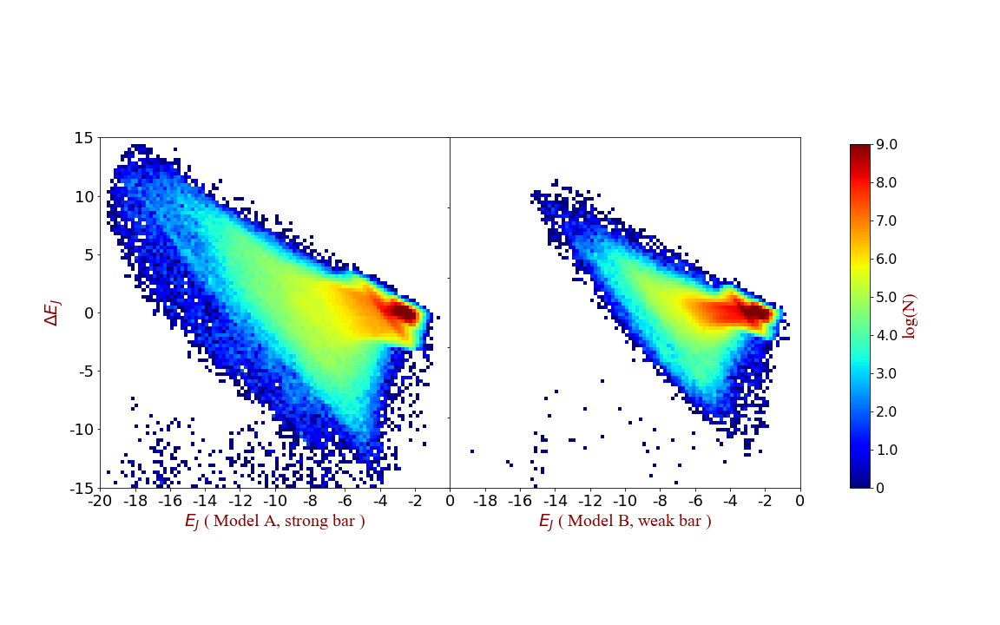
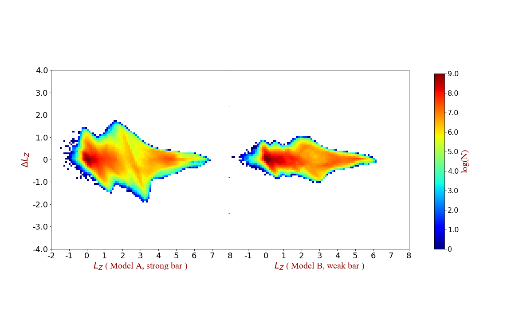
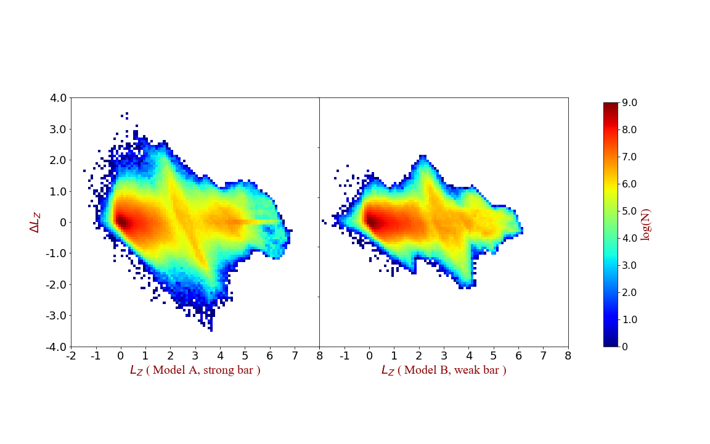
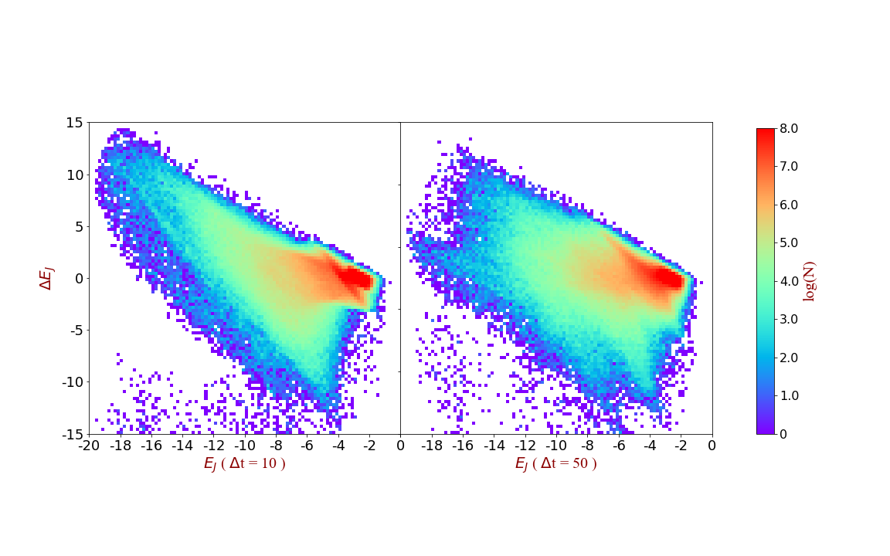
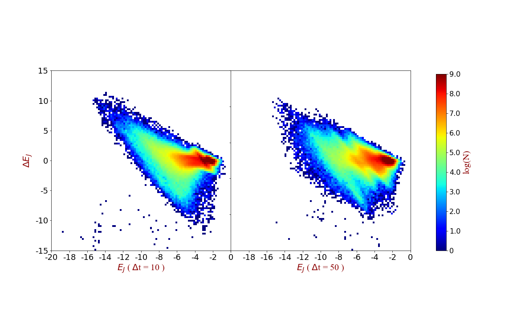
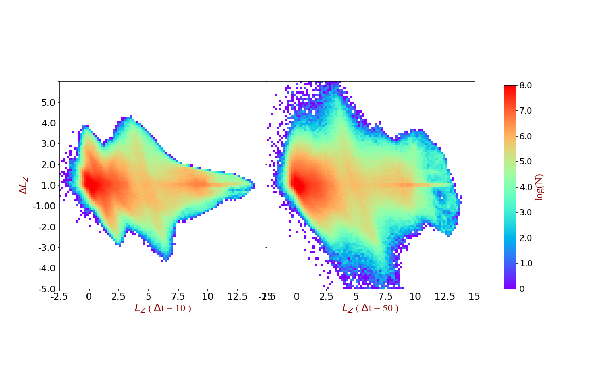
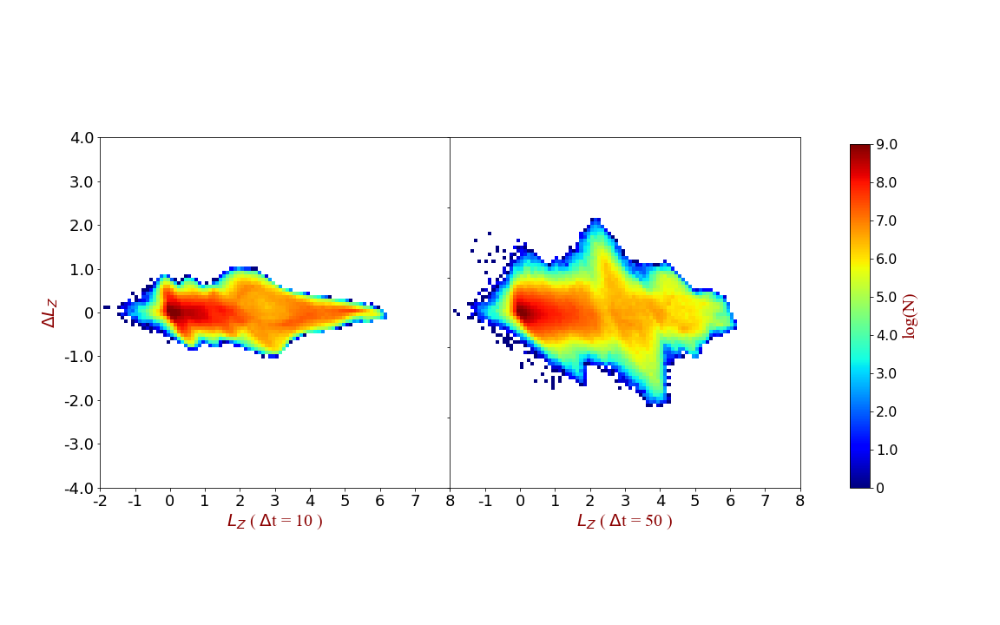

Comparing the results between strong bar model (&Omega;p = 0.542) and weak bar model (&Omega;p = 0.480)
----

### Jacobi Energy  

&Delta;T = 10  
                                            

&Delta;T = 50  
  

### Angular Momentum  

&Delta;T = 10  
                                            

&Delta;T = 50  
  

For two models separately
-----------

### Jacobi Energy

Strong bar model:  
                                            

Weak bar model:  
  

### Angular Momentum  

Strong bar model:  
                                            

Weak bar model:  
  
