## Model setting-up
<ol>
    <li>Disk has intial Toomre-Q = 1.5, and truncates at R = 6.</li>
    <li>Halo is rigid, with HERN index = 20, truncates at R = 500.</li>
    <li>Pattern speed (from <b>modefit</b>) &Omega;bar = 0.542, &Omega;spiral = 0.228</li>
    <li>The corresponding co-rotation radius (estimated from <b>spct</b>) Rbar ~ 3.2, and Rspiral ~ 7.0</li>
</ol>

All the following analysis is in <b>simulation units</b>.

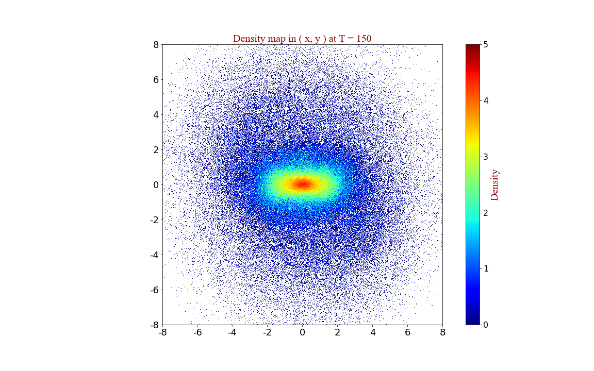

1.Angular momentum vs. R
----
The radial distribution of LZ at T = 150.

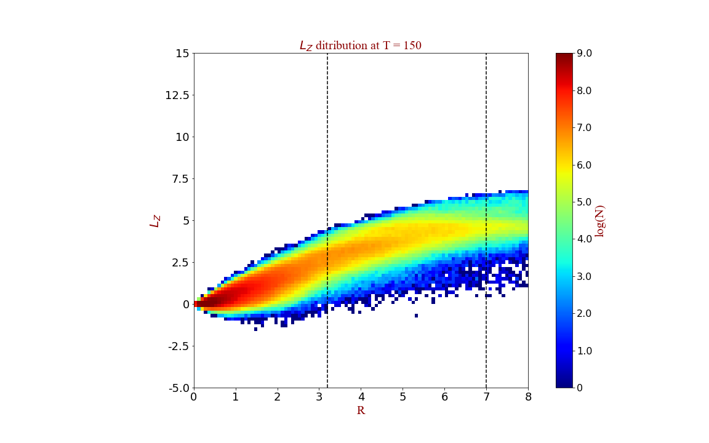  

Note: vertical dash lines show the position of <b>corotaion radius of bar (left) and spiral (right)</b>, estimated from subroutine <b>spct</b> with the pattern speed (i.e. &Omega;bar = 0.542, &Omega;spiral = 0.228).

2.Energy vs. R
----
The radial distribution of energy ( potential + kinetic ) at T = 150.

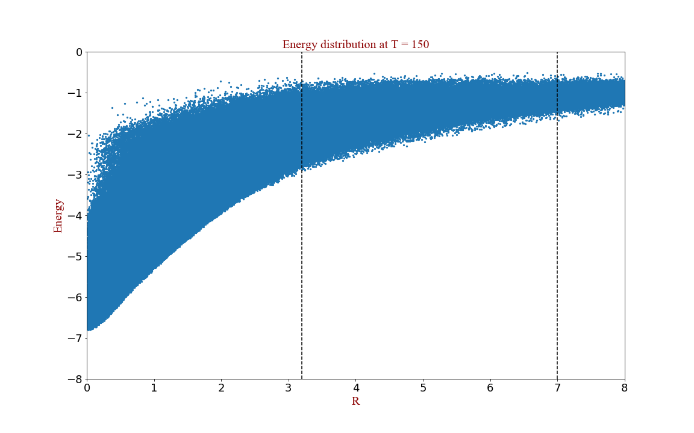 

3.Ej vs. R
----
The radial distribution of <b>Jacobi energy EJ</b>:   
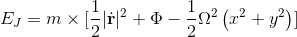   
at T = 150.  

<ul>
	<li> term is in the <b>rotating frame</b>;</li>
	<li>unequal mass is used.</li>  
</ul>  

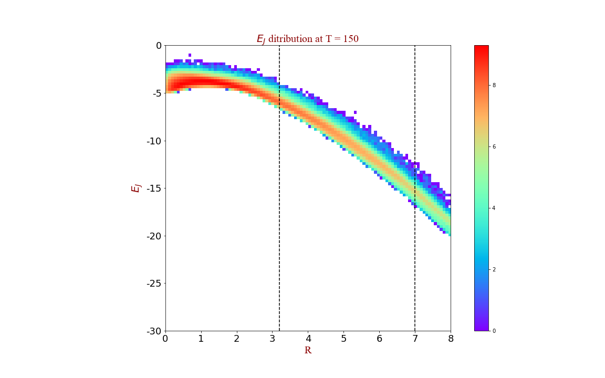  

4.change of the Jacobi Energy
----
The change of <b>Jacobi energy EJ </b> in &Delta;t =10 ( <b>T = 150 ~ 160</b> )  
EJ in x-axis is the Jacobi energy at T=150;  
&Delta;EJ is the difference between two times.  

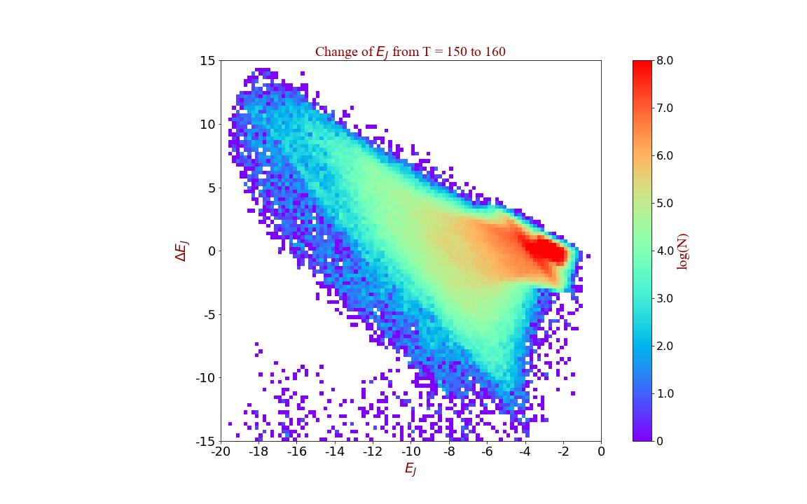                                                     

5.change of angular momentum
----
The change of <b>Angular Momentum Lz</b> in &Delta;t =10 ( <b>T = 150 ~ 160</b> )  
LZ in x-axis is the angular momentum at T=150;  
&Delta;LZ is the difference between two times.  

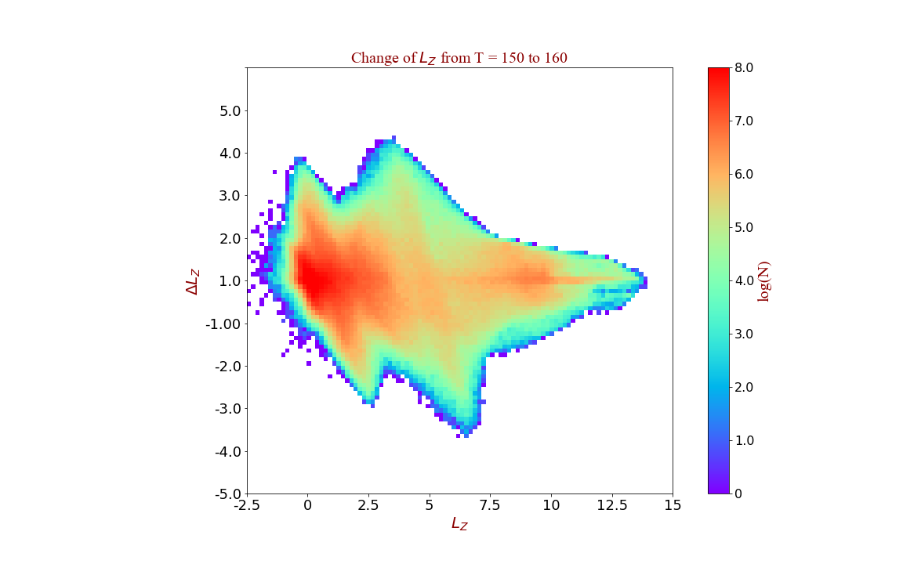                                                

6.Comparison with longer time intervals ( &Delta;t = 10 and &Delta;t = 50 )
----

### Jacobi Energy

                                                     

### Angular Momentum

                                                     

7.Distribution of Jacobi energy in (x, y) plane (T=150)
----
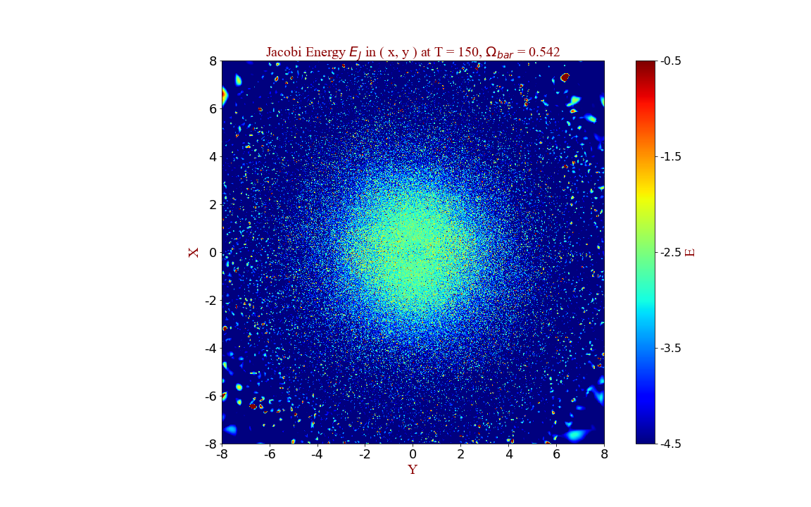

If dvided into several sub-populations:  
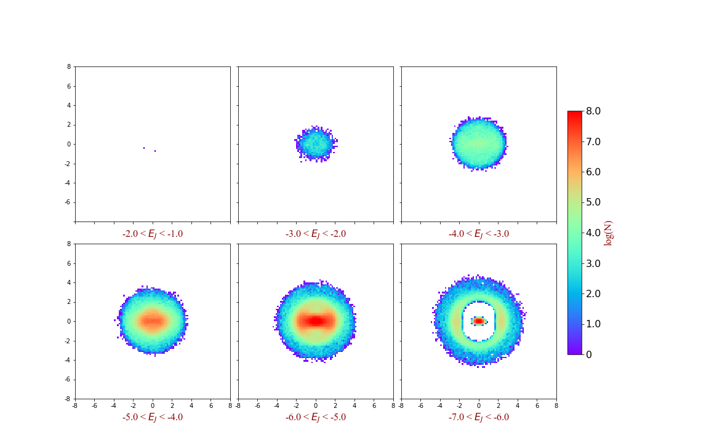      

8.Distribution of angular momentum in (x, y) plane (T=150)
----
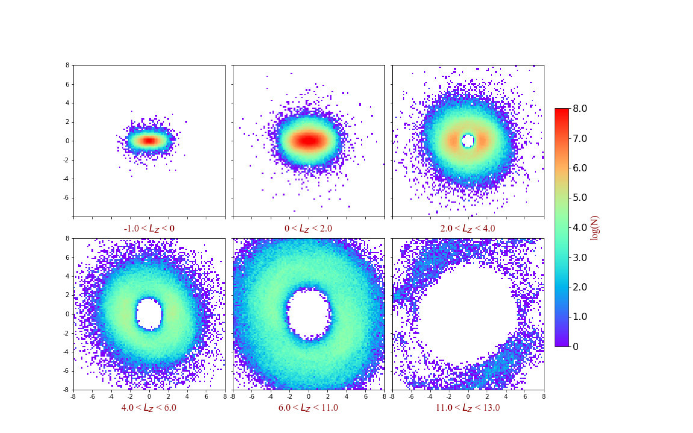  

## Bar model
<ul>
	
	<li>Pattern speed = 0.581</li>
	<li>setting-up is the same as the bar-spiral model except for the groove mode: no groove mode, stronger bar, weak spirals.</li>
	<li>use the same range of the plots in bar-spiral model.</li>
</ul>  

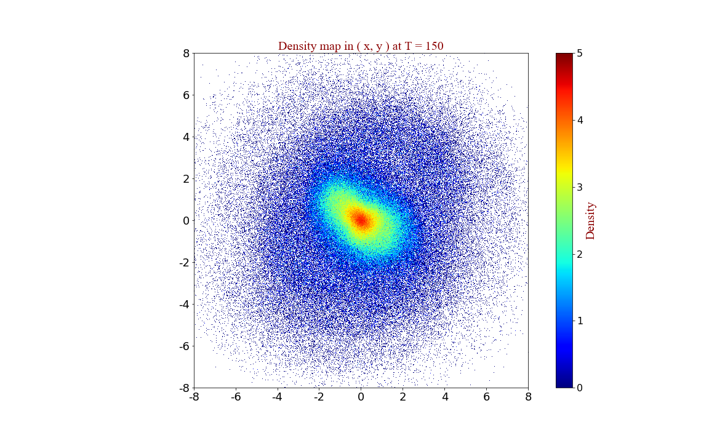

Comparison with longer time intervals ( &Delta;t = 10 and &Delta;t = 50 )
----

### Jacobi Energy

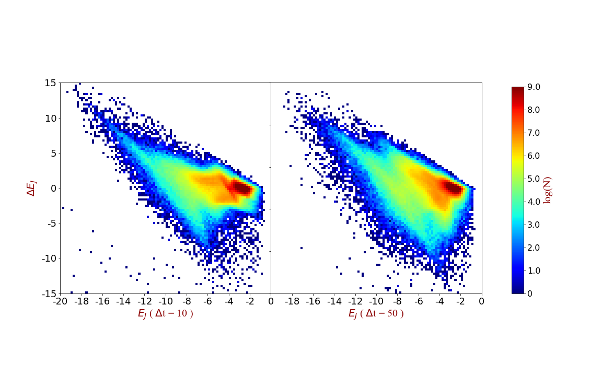                                                     

### Angular Momentum

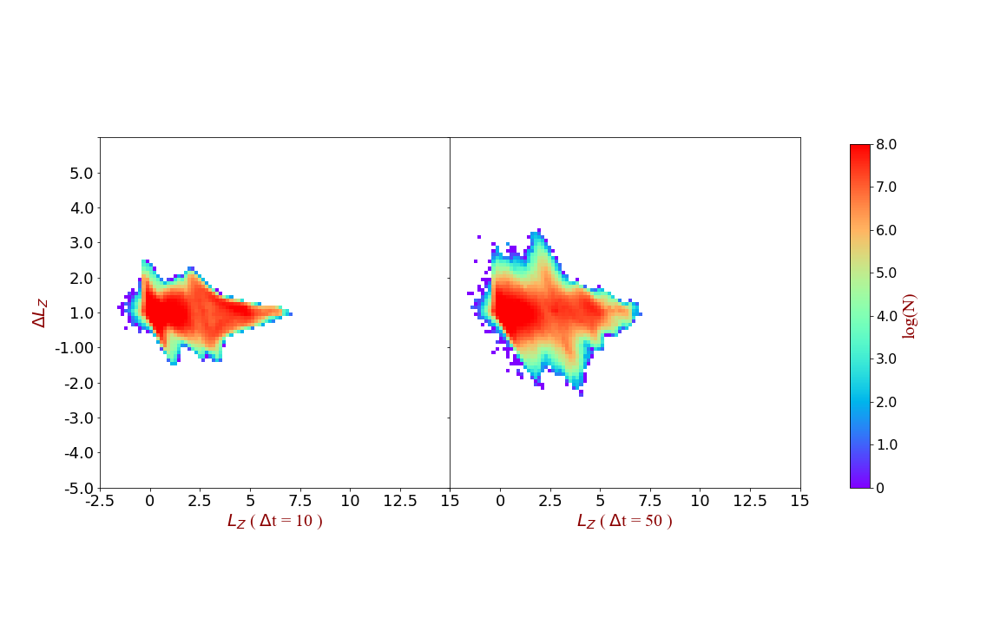         