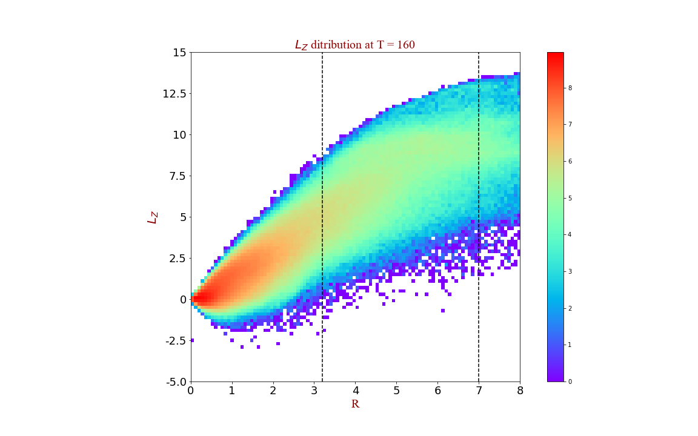
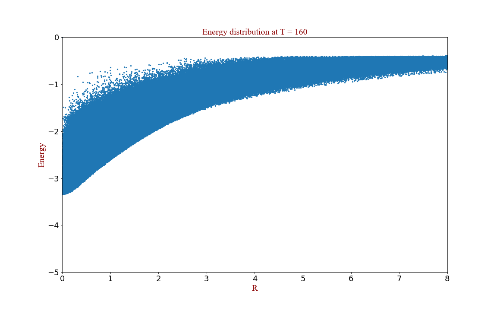
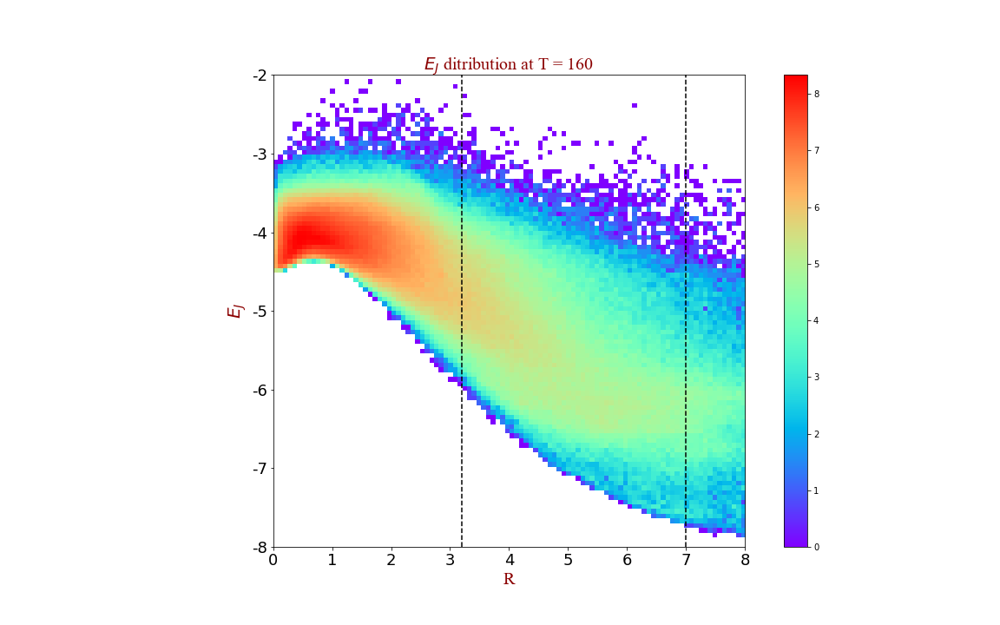
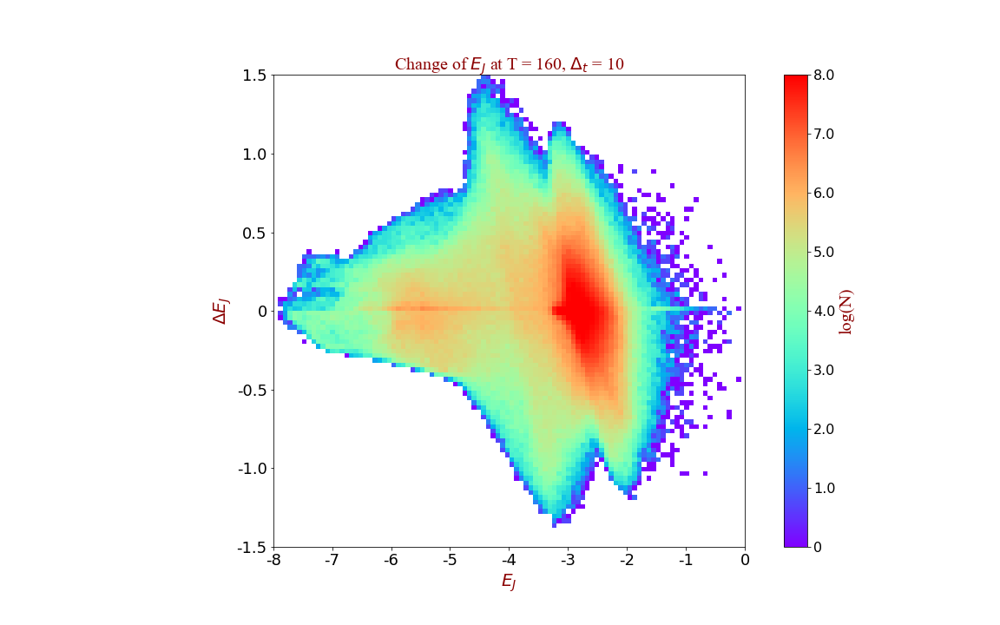
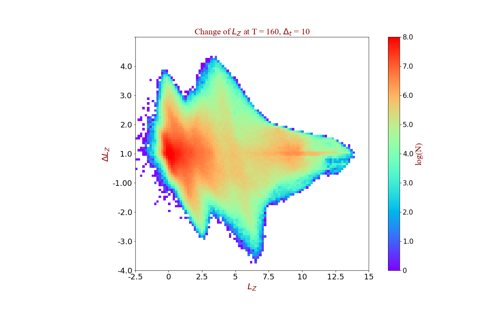

## Model setting-up
<ol>
    <li>Disk has intial Toomre-Q = 1.5, and truncates at R = 6.</li>
    <li>Halo is rigid, with HERN index = 20, truncates at R = 500.</li>
    <li>Pattern speed (from <b>modefit</b>) &Omega;bar = 0.542, &Omega;spiral = 0.228</li>
    <li>The corresponding co-rotation radius (estimated from <b>spct</b>) Rbar ~ 3.2, and Rspiral ~ 7.0</li>
</ol>

All the following analysis is in <b>simulation units</b>.

1.Angular momentum vs. R
----
The radial distribution of LZ at T = 160.

  

Note: vertical dash lines show the position of <b>corotaion radius of bar (left) and spiral (right)</b>, estimated from subroutine <b>spct</b> with the pattern speed (i.e. &Omega;bar = 0.542, &Omega;spiral = 0.228).

We can see in this figure:  
<ul>
    <li>inside the <b>RCR of bar</b> --> mainly <b>LZ < 7.5.</b> </li> 
    <li>around the <b>RCR of spiral</b> --> mainly <b>5 < LZ < 10.</b> </li>
</ul>

2.Energy vs. R
----
The radial distribution of energy ( potential + kinetic ) at T = 160.

 

3.Ej vs. R
----
The radial distribution of <b>Jacobi energy EJ ( EJ = E - &Omega;P &#10005; LZ )</b> at T = 160.  

  

<ul>
    <li>inside the <b>RCR of bar</b> --> mainly <b>EJ > -6.0 ( especially around -4.0 ).</b> </li> 
    <li>around the <b>RCR of spiral</b> --> mainly <b> -7.5 < EJ < -5.0. </b> </li>
</ul>

4.change of the Jacobi Energy
----
The change of <b>Jacobi energy EJ </b> in &Delta;t =10 ( <b>T = 150 ~ 160</b> )  
EJ in x-axis is the Jacobi energy at T=150;
&Delta;EJ is the difference between two times.

                                                     

Possible Features:      
<ol>
    <li>EJ ~ -3.0 ( very small fraction in bar, but is the <b>highest number density region</b> in this figure )</li>
    <li>EJ ~ -4.0 ( correspond to the <b>highest number density region in EJ vs. R figure</b> )</li>
    <li>EJ ~ -5.5 ( correspond to a very wide range, not sure this structure is due to <b>the CR of spiral</b> )</li> 
</ol>

5.change of angular momentum
----
The change of <b>Angular Momentum Lz</b> in &Delta;t =10 ( <b>T = 150 ~ 160</b> )
LZ in x-axis is the angular momentum at T=150;
&Delta;LZ is the difference between two times.

                                                     

Density peaks:  
<ol>
    <li>LZ < 2.0 ( all of the particles are <b>inside CR of bar.</b> )</li>
    <li>2.5 < LZ < 5.0 ( wide range of particles, not sure about the origin of these structures. But some of them should be related to <b>the CR of bar</b>. )</li>
    <li>LZ ~ 9. ( should be due to <b>the CR of spiral</b> )</li> 
</ol>

6.Notes
----
<ul>
    
    <li>Note this is only the evolution in a very small range of particles, thus the LZ transfer around the CR of spirals <b>should be very mild</b>. If we use a longer time interval, we expect <b>the structure in LZ - &Delta;LZ</b> should be more prominent for particles with LZ ~ 9. </li>
    <li>Due to the wide range of the LZ and EJ distribution in Radius, we are not sure whether these structures are really induced by these resonances (e.g. ILR, CR, OLR) at present.</li>
    
</ul>