## Inner region (0 ~ 3)  

1. Model with groove added at T = 50:

   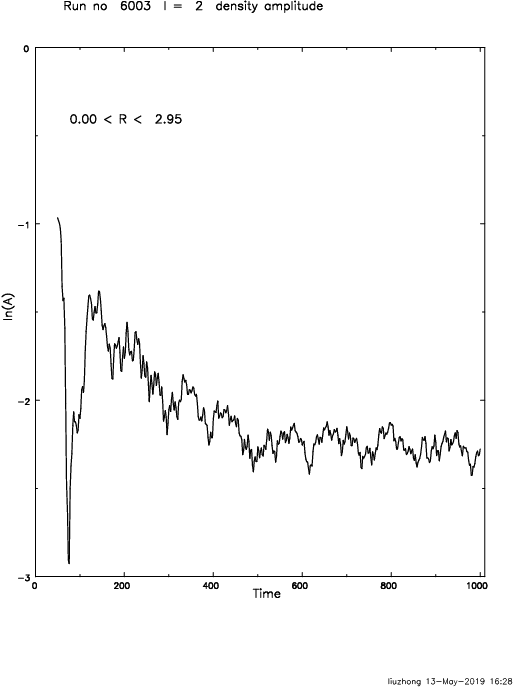

2. Model with groove added at T = 100:

   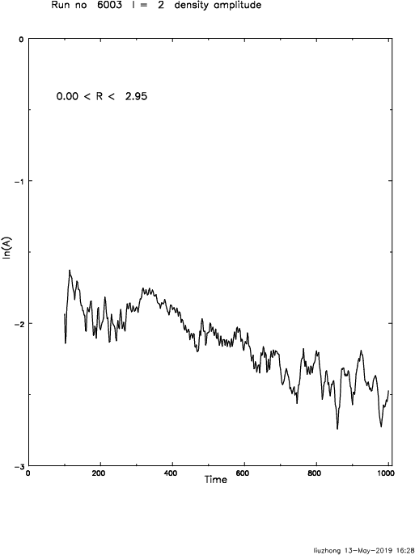

3. Model with groove added at T = 150:

   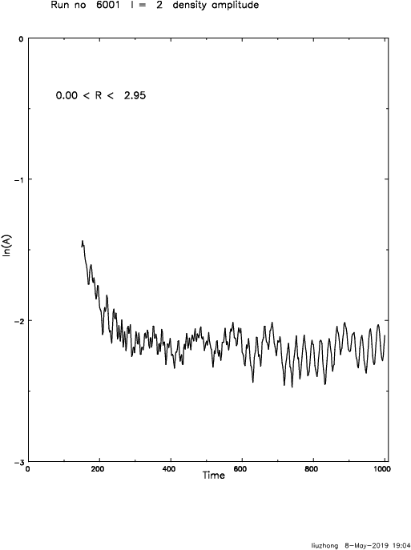
   
4. Model with groove added at T = 200:

   

5. Model with groove added at T = 250:

   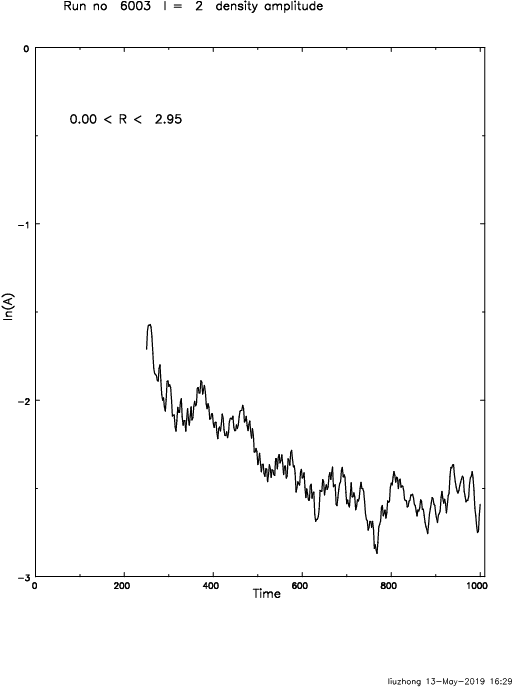

6. Model with groove added at T = 300:

   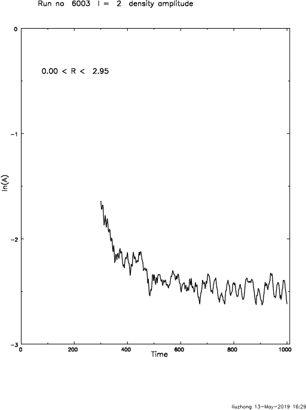

7. Model with groove added at T = 350:

   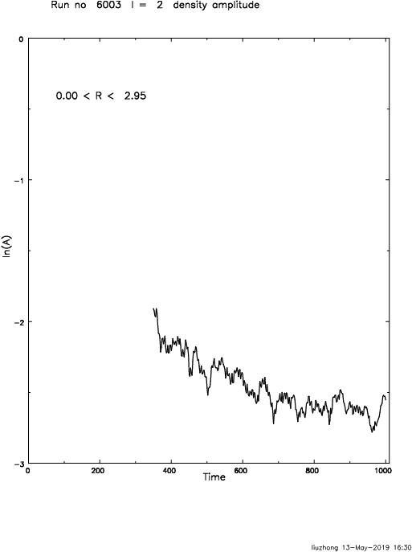

8. Model with groove added at T = 400:

   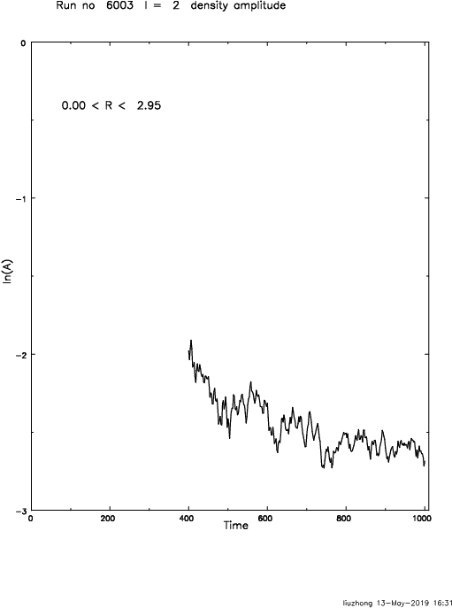

9. Model with groove added at T = 450:

   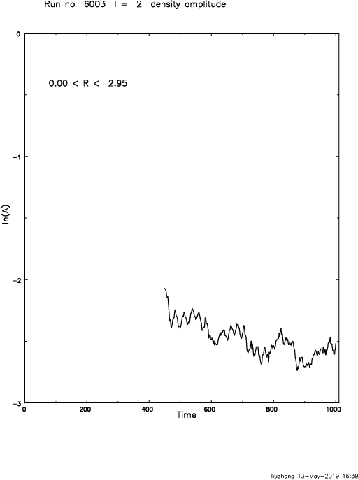

10. Model with groove added at T = 500:

   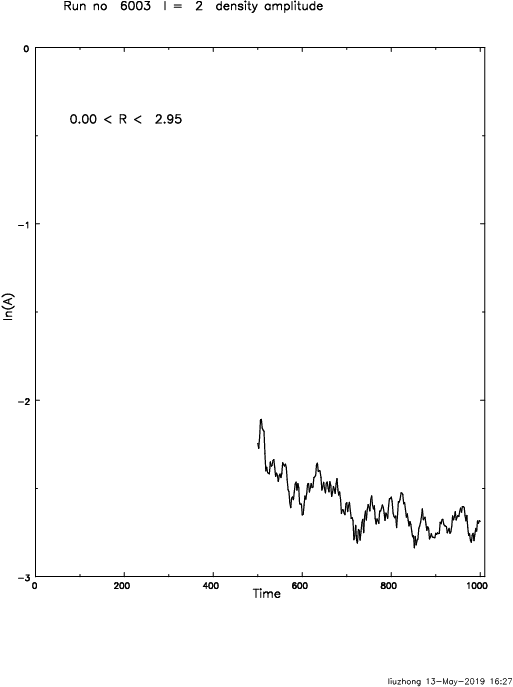

## Intermediate region (3 ~ 5)  

1. Model with groove added at T = 50:

   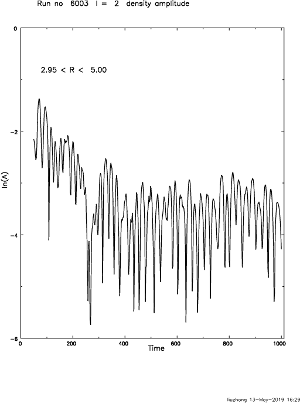

2. Model with groove added at T = 100:

   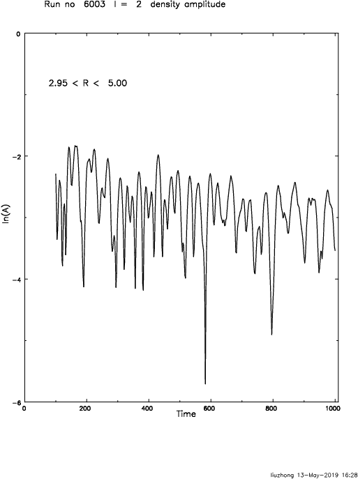

3. Model with groove added at T = 150:

   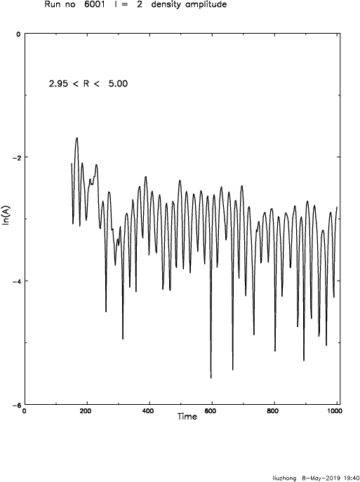
   
4. Model with groove added at T = 200:

   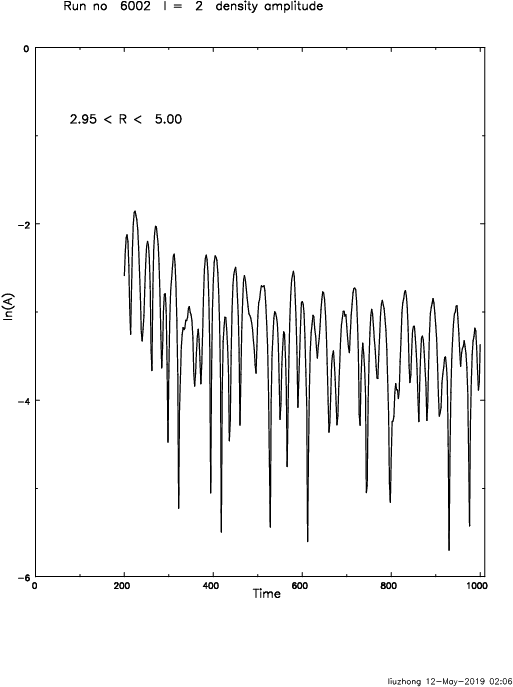

5. Model with groove added at T = 250:

   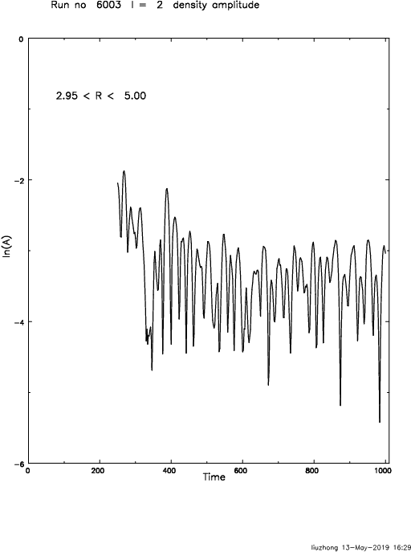

6. Model with groove added at T = 300:

   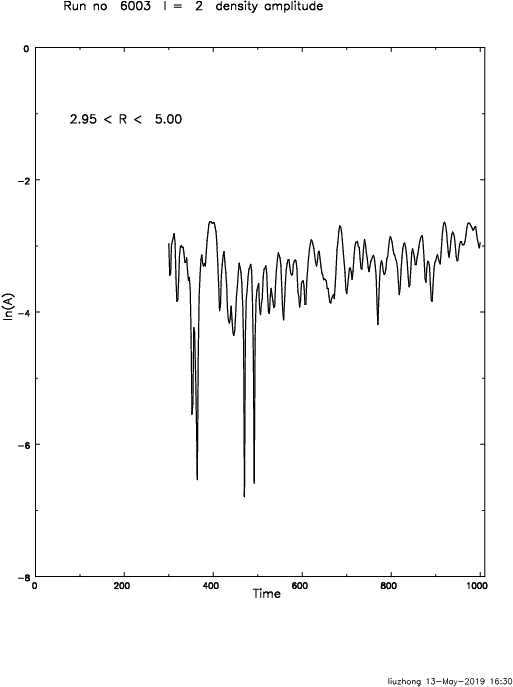

7. Model with groove added at T = 350:

   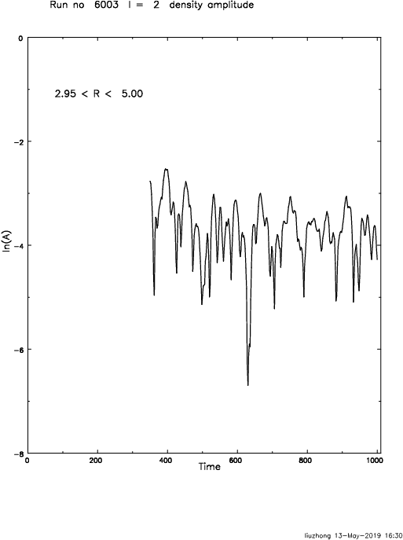

8. Model with groove added at T = 400:

   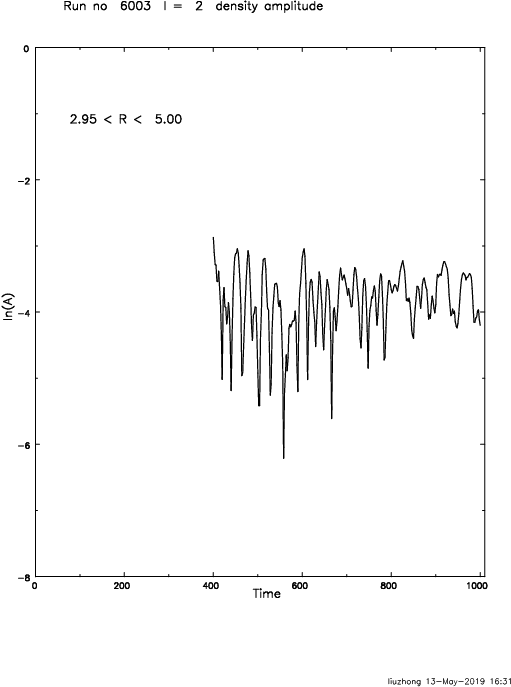

9. Model with groove added at T = 450:

   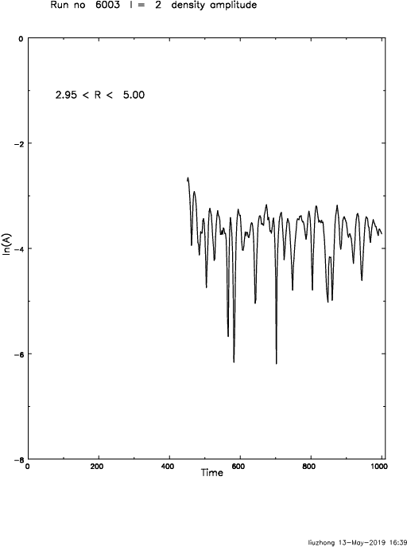

10. Model with groove added at T = 500:

   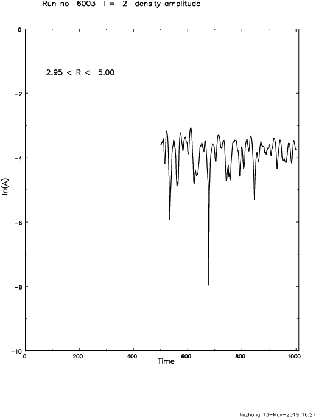

## Outer region (5 ~ 7)  

1. Model with groove added at T = 50:

   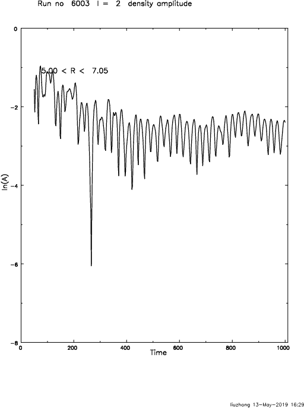

2. Model with groove added at T = 100:

   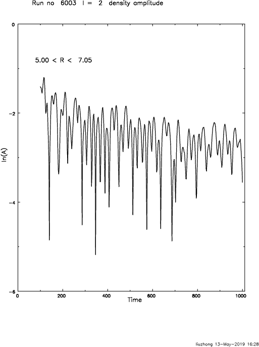

3. Model with groove added at T = 150:

   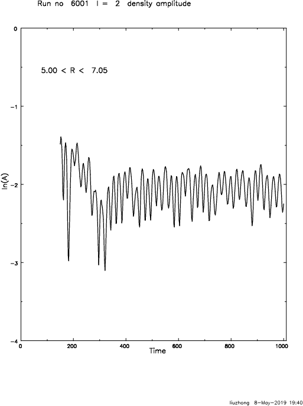
   
4. Model with groove added at T = 200:

   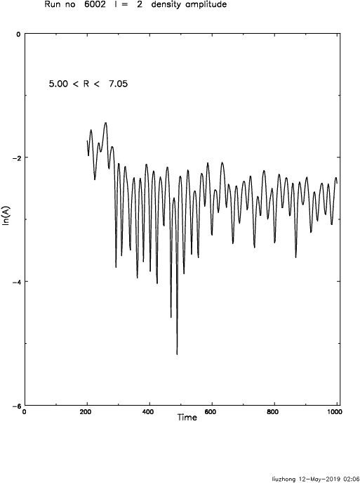

5. Model with groove added at T = 250:

   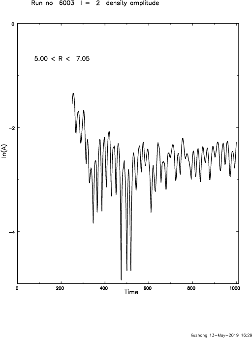

6. Model with groove added at T = 300:

   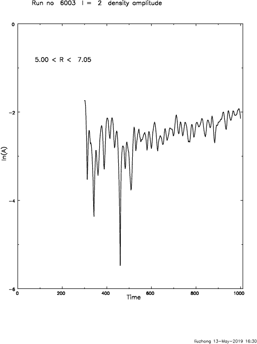

7. Model with groove added at T = 350:

   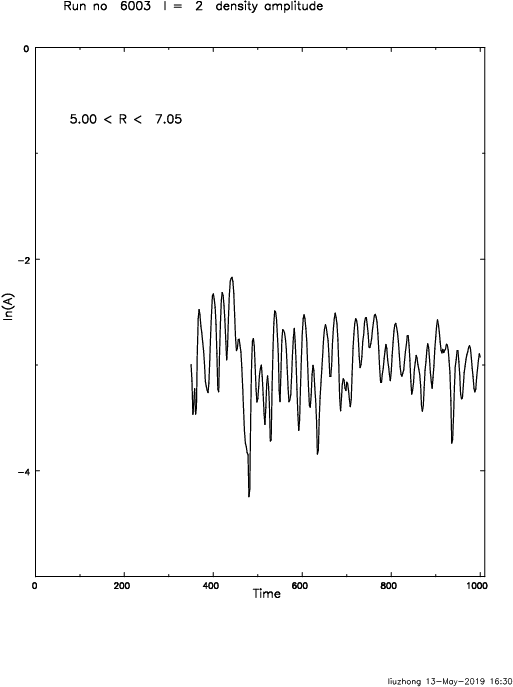

8. Model with groove added at T = 400:

   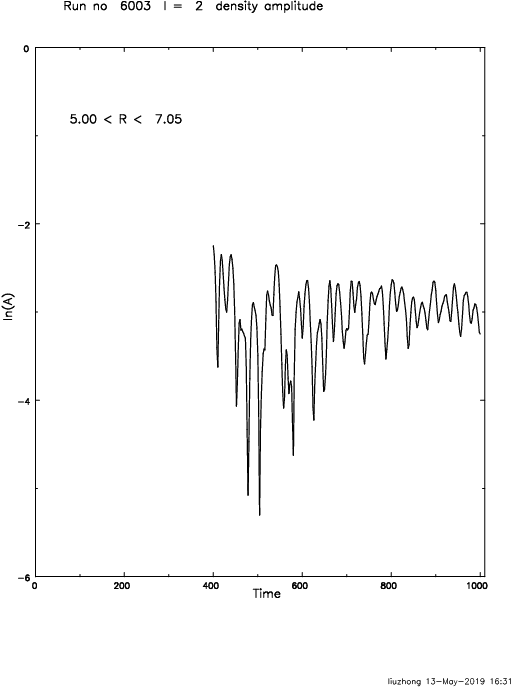

9. Model with groove added at T = 450:

   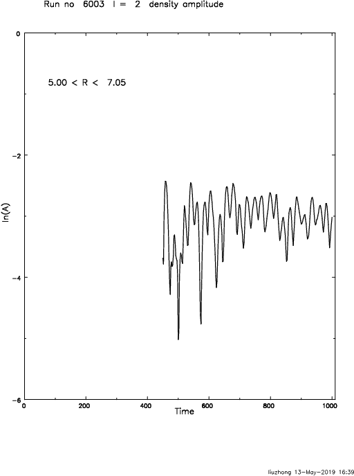

10. Model with groove added at T = 500:

   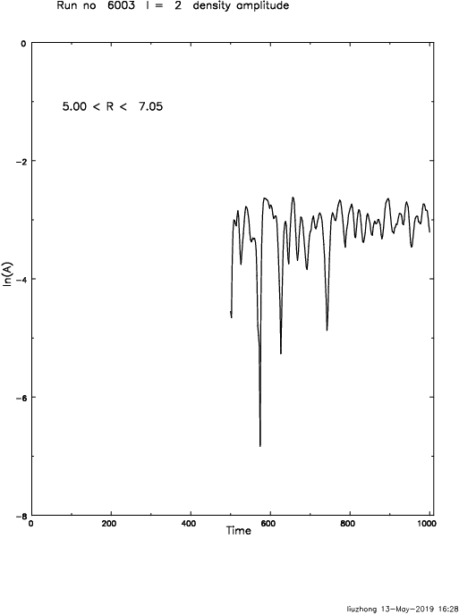